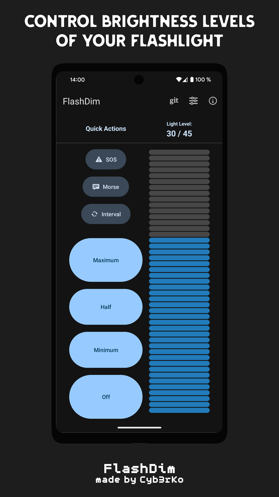
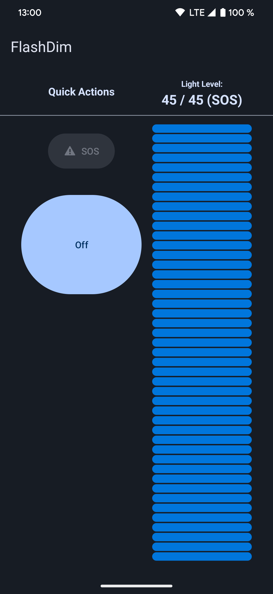
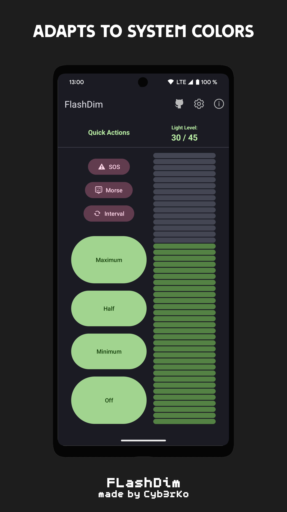
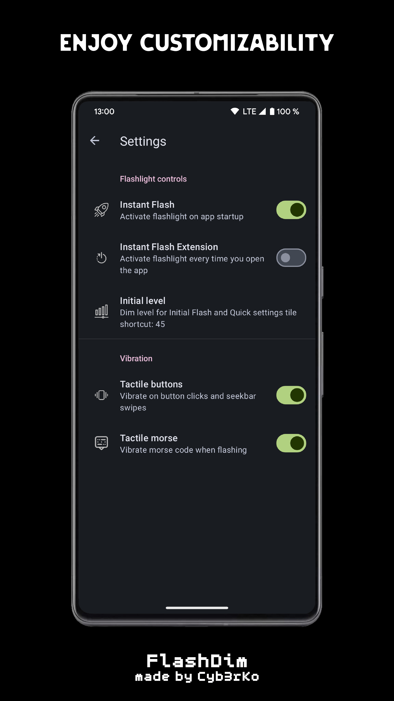
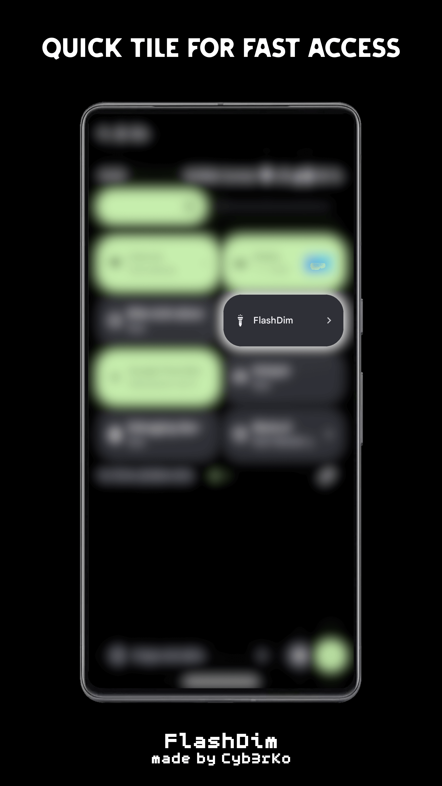
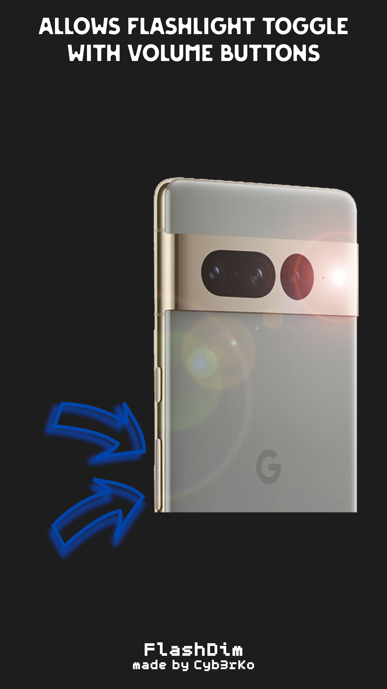

<h1 align="center">FlashDim - Dim your flashlight 🔦</h1>

<p align="center">
  <a href="https://matrix.to/#/#flashdim:matrix.org"></a>
  <a href="https://apilevels.com"></a>
  <a href="https://play.google.com/store/apps/details?id=com.cyb3rko.flashdim"></a>
  <a href="https://proxy.cyb3rko.de/shields/f-droid/v/com.cyb3rko.flashdim.svg?logo=fdroid"></a>
  <a href="https://github.com/cyb3rko/flashdim/releases/latest"></a>
  <a href="https://github.com/cyb3rko/flashdim/commits/main"></a>
  <a href="https://conventionalcommits.org"></a>
  <a href="https://www.apache.org/licenses/LICENSE-2.0"></a>
</p>

<p align="center">
  <a href="https://play.google.com/store/apps/details?id=com.cyb3rko.flashdim"></a><br/>
  <a href="https://trendshift.io/repositories/13351" target="_blank"></a><br/>
  <a href="https://github.com/cyb3rko/flashdim/releases/latest"></a>
</p>

---

- [About this project](#about-this-project)   
- [Features](#features)  
- [Download](#download)
  - [Verification](#verification)
- [Screenshots](#screenshots)
- [Supported devices](#supported-devices)
  - [Excluded devices (Play Store) / Unsupported devices](#excluded-devices-play-store--unsupported-devices)
- [Contribute](#contribute)
- [Used Icons](#used-icons)
- [License](#license)

---

[](https://www.youtube.com/watch?v=mVX444ksdg0)
[](https://androidauthority.com/google-pixel-8-best-apps-3372729/)
[](https://www.androidauthority.com/pixel-8-flashlight-half-intensity-3438214)
[](https://youtu.be/TOxEvJ_YM5g?t=279)
[](https://youtu.be/4gbSnaASTt0?t=140)
[](https://youtu.be/s6KNdNlNXho?t=257)
[](https://youtu.be/jFnLA5KV0L8?t=484)
[](https://youtu.be/C-qvkT2dawI?t=120)
---
[](https://medium.com/p/835cdf2d6f3e)

---

## About this project
Starting with Android 13, it's possible to control multiple brightness levels of the flashlight.  
To be able to use this new feature I've developed this app.

> [!IMPORTANT]  
> The full functionality of this app is ONLY AVAILABLE for devices which support the dim functionality of the flashlight (hardware limited).
> See [Supported devices](#supported-devices)

If you think it's worth to support this project, feel free to give a small donation :heart: ([Donate](#donate)).

Join the FlashDim Matrix room to talk with the community about the app or to ask me (the dev) anything:  
https://matrix.to/#/#flashdim:matrix.org

---

Inspired by [polodarb/Flashlight-Tiramisu](https://github.com/polodarb/Flashlight-Tiramisu) 💛  
Custom SeekBar built with code from [massoudss/waveformSeekBar](https://github.com/massoudss/waveformSeekBar) 💛

## Features
- 🔦 dimming your flashlight level by level
- 🎚 shortcut buttons for different brightness levels
- 🆘 SOS flash button
- 📫 morse code flash mode
- ⏲️ Interval / BPM mode
- ⚡ quick settings tile for fast access
- 🔊 press both volume buttons for easy flashlight toggle
- 🔒 private, no ads, no internet connection
- 💯 modern Material You (M3) design elements
- 🎨 app colors adapt to device's system colors

## Download

[](https://play.google.com/store/apps/details?id=com.cyb3rko.flashdim)
[](https://f-droid.org/app/com.cyb3rko.flashdim)
[](https://accrescent.app/app/com.cyb3rko.flashdim)
[](https://github.com/cyb3rko/flashdim/releases/latest)

Google Play and the Google Play logo are trademarks of Google LLC.

### Verification

The APK files can be verified using [apksigner](https://developer.android.com/studio/command-line/apksigner.html#options-verify).

```
apksigner verify --print-certs -v example.apk
```

---

**Google Play Store**  
The output should look like this:

```
Verifies
Verified using v1 scheme (JAR signing): false
Verified using v2 scheme (APK Signature Scheme v2): false
Verified using v3 scheme (APK Signature Scheme v3): true
```

The certificate content and digests should look like this:

```
DN: CN=Android, OU=Android, O=Google Inc., L=Mountain View, ST=California, C=US
Certificate Digests:
  SHA-256: 4b:05:58:fa:9d:2e:32:b0:1c:d0:00:7b:13:66:35:b5:ac:67:b5:ca:63:ff:c2:ef:e2:58:9a:80:20:e8:ca:4f
  SHA-1:   47:2d:b2:9e:57:df:be:48:09:55:3b:f9:c1:d8:15:a5:e3:ed:27:82
  MD5:     14:cc:12:d7:6b:29:9a:79:64:ac:36:c8:56:ec:a5:78
```

---

**F-Droid and GitHub** (signed using the same key)    
The output should look like this:

```
Verifies
Verified using v1 scheme (JAR signing): false
Verified using v2 scheme (APK Signature Scheme v2): true
```

The certificate content and digests should look like this:

```
DN: OU=FlashDim, O=Cyb3rKo OpenSource, L=GitHub / F-Droid, C=DE
Certificate Digests:
  SHA-256: ea:78:69:1c:ba:41:86:00:a4:56:32:89:b1:33:f9:d0:0d:3d:0c:24:a5:f5:4c:5c:59:ee:1c:95:2b:b0:e1:1d
  SHA-1:   28:cf:15:ea:1c:93:1a:04:67:2d:8e:b0:2f:01:77:9b:03:90:f8:dd
  MD5:     09:05:c3:62:fa:94:a0:2e:c4:9c:d0:4e:b8:a3:cc:99
```

## Screenshots
|||||
|:---:|:---:|:---:|:---:|
|||

## Supported Devices
The full functionality of this app is ONLY AVAILABLE for devices which support the dim functionality of the flashlight (hardware limited).  
Here's a list of devices I know of which do support flashlight dimming.

- Google Pixel 6/7/8/9 series
- nearly every Samsung phone with Android 13
- many other devices from different manufacturers

### Excluded devices (Play Store) / Unsupported devices

The following list contains phones, which were manually excluded in the Google Play Store because of missing flashlight dimming functionality.  
If the list contains any phone which does has a dimmable flashlight, please let me know.

<!--- marker1 -->
<b>Total: 841</b>

[8](#8) [A](#a) [B](#b) [C](#c) [D](#d) [E](#e) [F](#f) [G](#g) [H](#h) [I](#i) [L](#l) [M](#m) [N](#n) [O](#o) [P](#p) [Q](#q) [R](#r) [S](#s) [T](#t) [U](#u) [V](#v) [W](#w) [X](#x) [Z](#z)  
*Links may only work in common browsers*

<details name="8">
  <summary>8849 (2)</summary>
  <ul>
    <li>8849 TANK2 [8849 TANK2]</li>
    <li>8849 TANK3 [8849 TANK3]</li>
  </ul>
</details>
<details name="A">
  <summary>ACE France (2)</summary>
  <ul>
    <li>ACE France BUZZ 5 Pro [ACE BUZZ_5_Pro]</li>
    <li>ACE France BUZZ 5 Pro PLUS [ACE BUZZ_5_Pro_PLUS]</li>
  </ul>
</details>
<details>
  <summary>Anya (1)</summary>
  <ul>
    <li>Anya Anya_S558 [Anya S558]</li>
  </ul>
</details>
<details>
  <summary>Asus (5)</summary>
  <ul>
    <li>Asus ROG Phone 5 [asus ASUS_I005_1]</li>
    <li>Asus ROG Phone 6 [asus ASUS_AI2201]</li>
    <li>Asus Zenfone 8 [asus ASUS_I006D]</li>
    <li>Asus Zenfone 8 Flip [asus ASUS_I004D]</li>
    <li>Asus Zenfone 9 [asus ASUS_AI2202]</li>
  </ul>
</details>
<details>
  <summary>AT&T (2)</summary>
  <ul>
    <li>AT&T Calypso® 4 [ATT U380AA]</li>
    <li>AT&T Motivate® Pro 5G [ATT SN509A]</li>
  </ul>
</details>
<details>
  <summary>Atozee (1)</summary>
  <ul>
    <li>Atozee CP20_GOLD [ATOZEE CP20_GOLD]</li>
  </ul>
</details>
<details>
  <summary>Attila (1)</summary>
  <ul>
    <li>Attila WTATTRW2 [ATT WTATTRW2]</li>
  </ul>
</details>
<details name="B">
  <summary>benco (3)</summary>
  <ul>
    <li>benco AE9240 [benco AE9240]</li>
    <li>benco S1 Pro [benco AE9260]</li>
    <li>benco V91 [benco AE9310]</li>
  </ul>
</details>
<details>
  <summary>Blackview (9)</summary>
  <ul>
    <li>Blackview A52 Pro [Blackview A52Pro]</li>
    <li>Blackview BL9000 [Blackview BL9000]</li>
    <li>Blackview BL9000 Pro [Blackview BL9000_Pro]</li>
    <li>Blackview BV8900 [Blackview BV8900]</li>
    <li>Blackview BV8900 Pro [Blackview BV8900_Pro]</li>
    <li>Blackview BV9300 Pro [Blackview BV9300_Pro]</li>
    <li>Blackview N6000 [Blackview N6000]</li>
    <li>Blackview N6000 SE [Blackview N6000_SE]</li>
    <li>Blackview Shark 8 [Blackview Shark8]</li>
  </ul>
</details>
<details>
  <summary>Blu (6)</summary>
  <ul>
    <li>Blu B160V [BLU B160V]</li>
    <li>Blu BOLD N3 [BLU N0070]</li>
    <li>Blu G33 [BLU G0890, BLU G0892]</li>
    <li>Blu G53 [BLU G0850, BLU G0850_IW, BLU G0850_TIGO, BLU G0851]</li>
    <li>Blu G63 [BLU G0870]</li>
    <li>Blu G73 [BLU G0771]</li>
  </ul>
</details>
<details name="C">
  <summary>Cloud_Mobile (1)</summary>
  <ul>
    <li>Cloud_Mobile Stratus_C8 [Cloud_Mobile Stratus_C8]</li>
  </ul>
</details>
<details>
  <summary>Cricket (2)</summary>
  <ul>
    <li>Cricket Debut S2™ [Cricket U380AC]</li>
    <li>Cricket Outlast™ 5G [Cricket SN509C]</li>
  </ul>
</details>
<details>
  <summary>Cubot (3)</summary>
  <ul>
    <li>Cubot KINGKONG X [CUBOT KINGKONG_X]</li>
    <li>Cubot P80 [CUBOT P80]</li>
    <li>Cubot X70 [CUBOT X70]</li>
  </ul>
</details>
<details name="D">
  <summary>Daria (1)</summary>
  <ul>
    <li>Daria DM-B50104 [Daria zahedan]</li>
  </ul>
</details>
<details>
  <summary>Dcode (1)</summary>
  <ul>
    <li>Dcode DS_BD3 [DCODE DS_BD3]</li>
  </ul>
</details>
<details>
  <summary>Deutsche Telekom (3)</summary>
  <ul>
    <li>Deutsche Telekom T Phone 2 [DeutscheTelekom PUMA]</li>
    <li>Deutsche Telekom T Phone 2 Pro [DeutscheTelekom CHEETAH]</li>
    <li>Deutsche Telekom T Phone Pro [DeutscheTelekom Lion]</li>
  </ul>
</details>
<details>
  <summary>Doogee (8)</summary>
  <ul>
    <li>Doogee N50 [DOOGEE 1918Y]</li>
    <li>Doogee N50Pro [DOOGEE 1918N]</li>
    <li>Doogee N50S [DOOGEE 1918D]</li>
    <li>Doogee N55 [DOOGEE 1928]</li>
    <li>Doogee S110 [DOOGEE M22P]</li>
    <li>Doogee S200 [DOOGEE M24P]</li>
    <li>Doogee S200 X [DOOGEE M24PT]</li>
    <li>Doogee Smini [DOOGEE ZN137]</li>
  </ul>
</details>
<details name="E">
  <summary>Energizer (2)</summary>
  <ul>
    <li>Energizer U506S [Energizer U506S]</li>
    <li>Energizer U652S [Energizer U652S]</li>
  </ul>
</details>
<details name="F">
  <summary>Fairphone (3)</summary>
  <ul>
    <li>Fairphone 5 5G [Fairphone FP5]</li>
    <li>Fairphone Fairphone3 [Fairphone FP3]</li>
    <li>Fairphone Fairphone4 [Fairphone FP4]</li>
  </ul>
</details>
<details>
  <summary>FOSSiBOT (1)</summary>
  <ul>
    <li>FOSSiBOT F106 Pro ROW [FOSSiBOT F106_Pro]</li>
  </ul>
</details>
<details>
  <summary>FOXXD (2)</summary>
  <ul>
    <li>FOXXD A55 [FOXXD A55]</li>
    <li>FOXXD A56 [FOXXD A56]</li>
  </ul>
</details>
<details name="G">
  <summary>General Mobile (1)</summary>
  <ul>
    <li>General Mobile GM 23 Dual [GM G316]</li>
  </ul>
</details>
<details>
  <summary>Google (7)</summary>
  <ul>
    <li>Google Pixel 3a [google sargo]</li>
    <li>Google Pixel 4 [google flame]</li>
    <li>Google Pixel 4 XL [google coral]</li>
    <li>Google Pixel 4a [google sunfish]</li>
    <li>Google Pixel 4a 5G [google bramble]</li>
    <li>Google Pixel 5 [google redfin]</li>
    <li>Google Pixel 5a 5G [google barbet]</li>
  </ul>
</details>
<details name="H">
  <summary>Hisense (2)</summary>
  <ul>
    <li>Hisense E33 [Hisense HLTE243E_01]</li>
    <li>Hisense E70 [Hisense HLTE262E_01]</li>
  </ul>
</details>
<details>
  <summary>HMD (6)</summary>
  <ul>
    <li>HMD Fusion [HMD NHK]</li>
    <li>HMD M-KOPA X20 [HMD LGR]</li>
    <li>HMD Pulse [HMD LGD]</li>
    <li>HMD Pulse+ [HMD LGP]</li>
    <li>HMD Skyline Business Edition [HMD TCT]</li>
    <li>HMD Vibe [HMD SHK]</li>
  </ul>
</details>
<details>
  <summary>Honor (27)</summary>
  <ul>
    <li>Honor 200 Lite [HONOR HNLLY-M1]</li>
    <li>Honor HONOR 200 [HONOR HNELI, HONOR HNELIX]</li>
    <li>Honor HONOR 50 [HONOR HNNTH]</li>
    <li>Honor HONOR 50 Lite [HONOR HNNTN]</li>
    <li>Honor HONOR 70 [HONOR HNFNE]</li>
    <li>Honor HONOR 90 [HONOR HNREA]</li>
    <li>Honor HONOR 90 Lite [HONOR HNCRT-M2]</li>
    <li>Honor HONOR Magic4 Lite [HONOR HNANY-Q1]</li>
    <li>Honor HONOR Magic6 Lite 5G [HONOR HNALI-Q]</li>
    <li>Honor HONOR Magic7 Lite [HONOR HNBRP-Q1]</li>
    <li>Honor HONOR X5b [HONOR HNGFY-M]</li>
    <li>Honor HONOR X6 [HONOR HNVNE-M]</li>
    <li>Honor HONOR X6a [HONOR HNWDY-M]</li>
    <li>Honor HONOR X6b [HONOR HNJDY-M1]</li>
    <li>Honor HONOR X7 [HONOR HNCMA-Q]</li>
    <li>Honor HONOR X7a [HONOR HNRKY-M1]</li>
    <li>Honor HONOR X7b [HONOR HNCLK-Q]</li>
    <li>Honor HONOR X7b 5G [HONOR HNCLK-M1]</li>
    <li>Honor HONOR X7c [HONOR HNALT-QL]</li>
    <li>Honor HONOR X8 [HONOR HNTFY-Q]</li>
    <li>Honor HONOR X8a [HONOR HNCRT-M1]</li>
    <li>Honor HONOR X8a 5G [HONOR HNRBN-Q]</li>
    <li>Honor HONOR X8b [HONOR HNLLY-Q]</li>
    <li>Honor HONOR X9 [HONOR HNANY-Q1]</li>
    <li>Honor HONOR X9 5G [HONOR HNANY-Q]</li>
    <li>Honor HONOR X9a 5G [HONOR HNRMO-Q]</li>
    <li>Honor 荣耀X60 PRO [HONOR HNBRP-Q]</li>
  </ul>
</details>
<details>
  <summary>HTC (1)</summary>
  <ul>
    <li>HTC U23 Pro [HTC htc_soodugls]</li>
  </ul>
</details>
<details name="I">
  <summary>IIIF150 (4)</summary>
  <ul>
    <li>IIIF150 B2 [IIIF150 B2]</li>
    <li>IIIF150 B2 Pro [IIIF150 B2_Pro]</li>
    <li>IIIF150 B2 Ultra [IIIF150 B2_Ultra]</li>
    <li>IIIF150 Raptor LTD [IIIF150 Raptor]</li>
  </ul>
</details>
<details>
  <summary>Infinix (35)</summary>
  <ul>
    <li>Infinix GT 10 Pro [Infinix Infinix-X6739]</li>
    <li>Infinix GT 20 Pro [Infinix Infinix-X6871]</li>
    <li>Infinix HOT 30 [Infinix Infinix-X6831]</li>
    <li>Infinix HOT 30 5G [Infinix Infinix-X6832]</li>
    <li>Infinix HOT 30 PLAY [Infinix Infinix-X6835, Infinix Infinix-X6835B]</li>
    <li>Infinix HOT 40 [Infinix Infinix-X6836]</li>
    <li>Infinix HOT 40 Pro [Infinix Infinix-X6837]</li>
    <li>Infinix HOT 40i [Infinix Infinix-X6528, Infinix Infinix-X6528B]</li>
    <li>Infinix HOT 50 [Infinix Infinix-X6882, Infinix Infinix-X6882B]</li>
    <li>Infinix HOT 50 5G [Infinix Infinix-X6720, Infinix Infinix-X6720B]</li>
    <li>Infinix HOT 50 Pro [Infinix Infinix-X6881]</li>
    <li>Infinix HOT 50 Pro+ [Infinix Infinix-X6880]</li>
    <li>Infinix HOT 50i [Infinix Infinix-X6531, Infinix Infinix-X6531B]</li>
    <li>Infinix NOTE 12 [Infinix Infinix-X670]</li>
    <li>Infinix NOTE 12 Pro 5G [Infinix Infinix-X671B]</li>
    <li>Infinix NOTE 30 [Infinix Infinix-X6716, Infinix Infinix-X6716B, Infinix Infinix-X6833B]</li>
    <li>Infinix NOTE 30 5G [Infinix Infinix-X6711]</li>
    <li>Infinix NOTE 30 Pro [Infinix Infinix-X678B]</li>
    <li>Infinix NOTE 30 VIP [Infinix Infinix-X6710]</li>
    <li>Infinix NOTE 40 [Infinix Infinix-X6853]</li>
    <li>Infinix NOTE 40 Pro 5G [Infinix Infinix-X6851]</li>
    <li>Infinix NOTE 40 Pro+ 5G [Infinix Infinix-X6851B]</li>
    <li>Infinix NOTE 40X 5G [Infinix Infinix-X6838]</li>
    <li>Infinix NOTE 50 [Infinix Infinix-X6858]</li>
    <li>Infinix NOTE 50 Pro [Infinix Infinix-X6855]</li>
    <li>Infinix SMART 8 [Infinix Infinix-X6525D]</li>
    <li>Infinix SMART 8 HD [Infinix Infinix-X6525]</li>
    <li>Infinix SMART 8 Plus [Infinix Infinix-X6526]</li>
    <li>Infinix SMART 8 PRO [Infinix Infinix-X6525B]</li>
    <li>Infinix SMART 9 [Infinix Infinix-X6532]</li>
    <li>Infinix SMART 9 HD [Infinix Infinix-X6532C]</li>
    <li>Infinix ZERO 30 [Infinix Infinix-X6731B]</li>
    <li>Infinix ZERO 30 5G [Infinix Infinix-X6731]</li>
    <li>Infinix ZERO 40 5G [Infinix Infinix-X6861]</li>
    <li>Infinix ZERO 5G 2023 [Infinix Infinix-X6815C, Infinix Infinix-X6815D]</li>
  </ul>
</details>
<details>
  <summary>Itel (15)</summary>
  <ul>
    <li>Itel A05s [Itel itel-A663L, Itel itel-A663LC]</li>
    <li>Itel A671L-OP [Itel itel-A671L]</li>
    <li>Itel A70 [Itel itel-A665L]</li>
    <li>Itel itel A50 [Itel itel-A667L, Itel itel-A667LP]</li>
    <li>Itel itel A50C [Itel itel-A669L]</li>
    <li>Itel itel A80 [Itel itel-A671LC]</li>
    <li>Itel itel P40+ [Itel itel-P683L]</li>
    <li>Itel itel P55 [Itel itel-A666LN, itel-A666L]</li>
    <li>Itel itel P55 Bandhan [Itel itel-P661N]</li>
    <li>Itel itel P55T [Itel itel-P665L]</li>
    <li>Itel itel P55+ [Itel itel-P663L, Itel itel-P663LN]</li>
    <li>Itel itel RS4 [Itel itel-S666LN]</li>
    <li>Itel itel S23+ [Itel itel-S681LN]</li>
    <li>Itel itel S24 [Itel itel-S667LN]</li>
    <li>Itel P65 [Itel itel-P671LN]</li>
  </ul>
</details>
<details name="L">
  <summary>Lava (11)</summary>
  <ul>
    <li>Lava Blaze 2 5G [LAVA LXX507]</li>
    <li>Lava BLAZE 5G [LAVA LXX503]</li>
    <li>Lava Blaze Curve [LAVA LXX505]</li>
    <li>Lava Blaze Pro 5G [LAVA LXX506]</li>
    <li>Lava LAVA AGNI 2 5G [LAVA LXX504]</li>
    <li>Lava LAVA AGNI 5G [LAVA LXX501]</li>
    <li>Lava LAVA LXX513 [LAVA LXX513]</li>
    <li>Lava LAVA LZX414 [LAVA LZX414]</li>
    <li>Lava Storm 5G [LAVA LXX508]</li>
    <li>Lava YUVA 2 PRO [LAVA LZX408]</li>
    <li>Lava Yuva 5G [LAVA LXX510]</li>
  </ul>
</details>
<details>
  <summary>Lenovo (2)</summary>
  <ul>
    <li>Lenovo Legion Tab Y700 [Lenovo TB320FC]</li>
    <li>Lenovo Tab P12 [Lenovo TB370FU]</li>
  </ul>
</details>
<details>
  <summary>LGE (3)</summary>
  <ul>
    <li>LGE LG V60 ThinQ [lge timelm]</li>
    <li>LGE LG WING [lge winglm]</li>
    <li>LGE VELVET [lge caymanlm]</li>
  </ul>
</details>
<details>
  <summary>Logicom (1)</summary>
  <ul>
    <li>Logicom Elio [Logicom Elio]</li>
  </ul>
</details>
<details name="M">
  <summary>Memorex (1)</summary>
  <ul>
    <li>Memorex MTAB_PRO_2600 [MEMOREX MTAB_PRO_2600]</li>
  </ul>
</details>
<details>
  <summary>Mi (1)</summary>
  <ul>
    <li>Mi 11 X [Mi aliothin]</li>
  </ul>
</details>
<details>
  <summary>Mobicel (4)</summary>
  <ul>
    <li>Mobicell IX [Mobicel IX]</li>
    <li>Mobicell IX PRO [Mobicel IX_PRO]</li>
    <li>Mobicell IX-1 [Mobicel IX-1]</li>
    <li>Mobicell RX PRO [Mobicel RX_PRO]</li>
  </ul>
</details>
<details>
  <summary>Motorola (57)</summary>
  <ul>
    <li>Motorola moto e13 [motorola sabahl]</li>
    <li>Motorola moto e14 [motorola lionl]</li>
    <li>Motorola moto edge X30 [motorola hiphic]</li>
    <li>Motorola moto g 5G (2022) [motorola austin]</li>
    <li>Motorola moto g 5G - 2023 [motorola pnangn]</li>
    <li>Motorola moto g 5G - 2024 [motorola fogo]</li>
    <li>Motorola moto g play - 2023 [motorola maui]</li>
    <li>Motorola moto g play - 2024 [motorola fogona]</li>
    <li>Motorola moto g power 5G - 2023 [motorola devonn]</li>
    <li>Motorola moto g power 5G - 2024 [motorola cancunn]</li>
    <li>Motorola moto g stylus 5G (2022) [motorola milanf]</li>
    <li>Motorola moto g stylus 5G - 2023 [motorola genevn]</li>
    <li>Motorola moto g stylus 5G - 2024 [motorola boston]</li>
    <li>Motorola moto g stylus (2023) [motorola gnevan]</li>
    <li>Motorola moto g - 2025 [motorola kansas]</li>
    <li>Motorola moto g04s [motorola lion]</li>
    <li>Motorola moto g05 [motorola lamul]</li>
    <li>Motorola moto g13 [motorola penangf]</li>
    <li>Motorola moto g14 [motorola cancun]</li>
    <li>Motorola moto g24 [motorola fogorow]</li>
    <li>Motorola moto g32 [motorola devon]</li>
    <li>Motorola moto g34 [motorola fogos]</li>
    <li>Motorola moto g35 5G [motorola manila]</li>
    <li>Motorola moto g42 [motorola hawao]</li>
    <li>Motorola moto g52 [motorola rhode]</li>
    <li>Motorola moto g53y 5G [motorola penang]</li>
    <li>Motorola moto g54 5G [motorola cancunf]</li>
    <li>Motorola moto g62 5G [motorola rhodec, motorola rhodei]</li>
    <li>Motorola moto g72 [motorola vicky]</li>
    <li>Motorola moto g73 5G [motorola devonf]</li>
    <li>Motorola moto g75 5G [motorola sorap]</li>
    <li>Motorola moto g82 5G [motorola rhodep]</li>
    <li>Motorola moto g84 5G [motorola bangkk]</li>
    <li>Motorola moto g85 5G [motorola malmo]</li>
    <li>Motorola moto g(60) [motorola hanoip]</li>
    <li>Motorola motorola edge 20 [motorola berlin]</li>
    <li>Motorola motorola edge 20 lite [motorola kyoto]</li>
    <li>Motorola motorola edge 2023 [motorola aion]</li>
    <li>Motorola motorola edge 2024 [motorola avatrn]</li>
    <li>Motorola motorola edge 30 [motorola dubai]</li>
    <li>Motorola motorola edge 30 fusion [motorola tundra]</li>
    <li>Motorola motorola edge 30 neo [motorola miami]</li>
    <li>Motorola motorola edge 30 ultra [motorola eqs]</li>
    <li>Motorola motorola edge 40 [motorola lyriq]</li>
    <li>Motorola motorola edge 40 neo [motorola manaus]</li>
    <li>Motorola motorola edge 50 [motorola tank]</li>
    <li>Motorola motorola edge 50 fusion [motorola cusco, motorola cuscoi]</li>
    <li>Motorola motorola edge 60 stylus [motorola monai]</li>
    <li>Motorola motorola edge plus 2023 [motorola rtwo]</li>
    <li>Motorola motorola edge plus 5G UW (2022) [motorola hiphi]</li>
    <li>Motorola motorola edge s pro [motorola pstar]</li>
    <li>Motorola motorola edge (2021) [motorola berlna]</li>
    <li>Motorola motorola edge (2022) [motorola tesla]</li>
    <li>Motorola motorola razr 2022 [motorola oneli]</li>
    <li>Motorola motorola razr 40 [motorola lynkco]</li>
    <li>Motorola motorola razr plus 2023 [motorola zeekr]</li>
    <li>Motorola ThinkPhone by Motorola [motorola bronco]</li>
  </ul>
</details>
<details>
  <summary>Moxee Technologies (1)</summary>
  <ul>
    <li>Moxee Technologies Moxee_T2310 [Moxee T2310]</li>
  </ul>
</details>
<details>
  <summary>M-KOPA (1)</summary>
  <ul>
    <li>M-KOPA M10 [HMD NYX]</li>
  </ul>
</details>
<details name="N">
  <summary>Nokia (11)</summary>
  <ul>
    <li>Nokia C22 [Nokia HKEA]</li>
    <li>Nokia C32 [Nokia MKDA]</li>
    <li>Nokia G10 [Nokia ROGA_sprout]</li>
    <li>Nokia G11 [Nokia SCTA_sprout, Nokia SCT_sprout]</li>
    <li>Nokia G11 Plus [Nokia MGKA_sprout]</li>
    <li>Nokia G21 [Nokia SCPA_sprout, Nokia SCP_sprout]</li>
    <li>Nokia G22 [Nokia SFI, Nokia SFIA]</li>
    <li>Nokia G42 5G [Nokia SDW, Nokia SDWA]</li>
    <li>Nokia G50 [Nokia PHR_sprout]</li>
    <li>Nokia T10 [Nokia PGN]</li>
    <li>Nokia X20 [Nokia QKS_sprout]</li>
  </ul>
</details>
<details>
  <summary>Nothing (2)</summary>
  <ul>
    <li>Nothing Phone 1 [Nothing Spacewar]</li>
    <li>Nothing Phone 2 [Nothing Pong]</li>
  </ul>
</details>
<details name="O">
  <summary>OnePlus (35)</summary>
  <ul>
    <li>OnePlus 7 [OnePlus OnePlus7]</li>
    <li>OnePlus 8 [OnePlus OnePlus8]</li>
    <li>OnePlus 8 5G [OnePlus OnePlus8TMO]</li>
    <li>OnePlus 8 Pro [OnePlus OnePlus8Pro]</li>
    <li>OnePlus 8T [OnePlus OnePlus8T]</li>
    <li>OnePlus 8T+ 5G [OnePlus OnePlus8TTMO]</li>
    <li>OnePlus 9 5G [OnePlus OnePlus9, OnePlus OnePlus9TMO]</li>
    <li>OnePlus 9 Pro 5G [OnePlus OnePlus9Pro, OnePlus OnePlus9ProTMO]</li>
    <li>OnePlus 9R [OnePlus OnePlus9R]</li>
    <li>OnePlus 9RT 5G [OnePlus OP5154L1, OnePlus OP5155L1]</li>
    <li>OnePlus 10 Pro [OnePlus OP516EL1]</li>
    <li>OnePlus 10 Pro 5G [OnePlus OP516FL1]</li>
    <li>OnePlus 10R 5G [OnePlus OP5566L1, OnePlus OP5567L1]</li>
    <li>OnePlus 10T 5G [OnePlus OP5552L1]</li>
    <li>OnePlus 11 5G 中国版 [OnePlus OP591BL1]</li>
    <li>OnePlus 11R 5G [OnePlus OP5961L1]</li>
    <li>OnePlus 12 [OnePlus OP5929L1]</li>
    <li>OnePlus Ace [OnePlus OP5565]</li>
    <li>OnePlus Ace 3 [OnePlus OP5CF9L1]</li>
    <li>OnePlus Ace 竞速版 [OnePlus OP5911]</li>
    <li>OnePlus Nord 2T 5G [OnePlus OP557AL1]</li>
    <li>OnePlus Nord 3 5G [OnePlus OP556FL1]</li>
    <li>OnePlus Nord CE 2 [OnePlus OP555BL1]</li>
    <li>OnePlus Nord CE 2 Lite 5G [OnePlus OP535DL1]</li>
    <li>OnePlus Nord CE 3 5G [OnePlus OP5953L1]</li>
    <li>OnePlus Nord CE 3 Lite 5G [OnePlus OP5958L1]</li>
    <li>OnePlus Nord CE 5G [OnePlus OnePlusNordCE]</li>
    <li>OnePlus Nord CE4 [OnePlus OP5D3FL1]</li>
    <li>OnePlus Nord N30 5G [OnePlus OP5958L1]</li>
    <li>OnePlus Nord N30 SE 5G [OnePlus OP5955L1]</li>
    <li>OnePlus Nord N300 5G [OnePlus OP5547L1]</li>
    <li>OnePlus Nord2 5G [OnePlus OP515BL1]</li>
    <li>OnePlus Oneplus Nord CE4 Lite 5G [OnePlus OP5D49L1]</li>
    <li>OnePlus OnePlus6T [OnePlus OnePlus6T]</li>
    <li>OnePlus Open [OnePlus OP5973L1]</li>
  </ul>
</details>
<details>
  <summary>onn. (1)</summary>
  <ul>
    <li>onn. 100135924 [onn mid7021_mq]</li>
  </ul>
</details>
<details>
  <summary>Oppo (68)</summary>
  <ul>
    <li>Oppo A18 [OPPO OP575DL1]</li>
    <li>Oppo A3 5G [OPPO OP5B05L1]</li>
    <li>Oppo A38 [OPPO OP5759L1]</li>
    <li>Oppo A54 5G [OPPO OP4F39L1]</li>
    <li>Oppo A57 [OPPO OP5355]</li>
    <li>Oppo A58 [OPPO OP574FL1]</li>
    <li>Oppo A59 5G [OPPO OP5AD5L1]</li>
    <li>Oppo A76 [OPPO OP5312L1]</li>
    <li>Oppo A78 [OPPO OP5745L1]</li>
    <li>Oppo A78 5G [OPPO OP52F3L1]</li>
    <li>Oppo A79 5G [OPPO OP573DL1]</li>
    <li>Oppo A98 5G [OPPO OP56E8L1]</li>
    <li>Oppo CPH2145 [OPPO OP4F1BL1]</li>
    <li>Oppo CPH2207 [OPPO OP4F0BL1]</li>
    <li>Oppo CPH2211 [OPPO OP4F4DL1]</li>
    <li>Oppo CPH2235 [OPPO OP4F25L1]</li>
    <li>Oppo CPH2249 [OPPO OP4F81L1]</li>
    <li>Oppo CPH2251 [OPPO OP4F83L1]</li>
    <li>Oppo CPH2293 [OPPO OP52E1L1]</li>
    <li>Oppo CPH2325 [OPPO OP5303]</li>
    <li>Oppo CPH2333 [OPPO OP530DL1]</li>
    <li>Oppo CPH2365 [OPPO OP4F11L1]</li>
    <li>Oppo CPH2373 [OPPO OP530DL1]</li>
    <li>Oppo CPH2385 [OPPO OP571DL1]</li>
    <li>Oppo CPH2387 [OPPO OP571F]</li>
    <li>Oppo CPH2457 [OPPO OP56E1L1]</li>
    <li>Oppo CPH2473 [OPPO OP5637L1]</li>
    <li>Oppo CPH2527 [OPPO OP56E7L1]</li>
    <li>Oppo Find X2 [OPPO OP4BA1L1]</li>
    <li>Oppo Find X2 Pro [OPPO OP4BA2L1]</li>
    <li>Oppo Find X2 Pro 中国版 [OPPO OP4A7A]</li>
    <li>Oppo Find X2 中国版 [OPPO OP4A77]</li>
    <li>Oppo Find X3 Pro [OPPO OP4F57L1]</li>
    <li>Oppo Find X3 Pro 中国版 [OPPO OP4E3F]</li>
    <li>Oppo Find X3 中国版 [OPPO OP4E5D]</li>
    <li>Oppo Find X5 [OPPO OP52D5L1]</li>
    <li>Oppo Find X5 Pro [OPPO OP52D1L1]</li>
    <li>Oppo OPPO A1 5G [OPPO OP561D]</li>
    <li>Oppo OPPO A57s [OPPO OP5353L1]</li>
    <li>Oppo OPPO A60 5G/ A3 5G [OPPO OP5EA7L1]</li>
    <li>Oppo OPPO F27 Pro+ 5G [OPPO OP5B19L1]</li>
    <li>Oppo OPPO Reno5 pro [OPPO OP4F1FL1]</li>
    <li>Oppo OPPO Reno5 Pro+ 5G [OPPO OP4EA7]</li>
    <li>Oppo OPPO Reno6 Z 5G [OPPO OP4FA7L1]</li>
    <li>Oppo OPPO Reno7 [OPPO OP533FL1]</li>
    <li>Oppo OPPO Reno7 5G [OPPO OPD4A1L1]</li>
    <li>Oppo OPPO Reno7 Z 5G [OPPO OP532FL1]</li>
    <li>Oppo OPPO Reno7 Z 5G/F21 Pro 5G/Reno8 Lite 5G [OPPO OP532FL1]</li>
    <li>Oppo OPPO Reno8 5G [OPPO OP5339L1]</li>
    <li>Oppo OPPO Reno8 Pro 5G [OPPO OP5335L1]</li>
    <li>Oppo OPPO Reno8 T [OPPO OP5709L1]</li>
    <li>Oppo OPPO Reno9 Pro 5G [OPPO OP5601]</li>
    <li>Oppo OPPO Reno10 5G [OPPO OP5655]</li>
    <li>Oppo OPPO Reno10 Pro 5G [OPPO OP561F]</li>
    <li>Oppo OPPO Reno10 Pro+ 5G [OPPO OP564B]</li>
    <li>Oppo PEGT00 [OPPO OP4E8F]</li>
    <li>Oppo PFZM10 [OPPO OP5281]</li>
    <li>Oppo Reno 11 Pro [OPPO OP5AD3L1]</li>
    <li>Oppo Reno5 Lite [OPPO OP4F43L1]</li>
    <li>Oppo Reno6 Pro+ 5G [OPPO OP4EC1]</li>
    <li>Oppo Reno7 中国版 [OPPO OP5227]</li>
    <li>Oppo Reno8 T 5G [OPPO OP56EDL1]</li>
    <li>Oppo Reno9 A [OPPO OP5701L1]</li>
    <li>Oppo Reno10 5G [OPPO OP5705L1]</li>
    <li>Oppo Reno10 Pro 5G [OPPO OP56DBL1]</li>
    <li>Oppo Reno10 Pro+ 5G [OPPO OP56D3L1]</li>
    <li>Oppo Reno11 F 5G [OPPO OP5A0BL1]</li>
    <li>Oppo Reno12 F 5G [OPPO OP5AF2L1]</li>
  </ul>
</details>
<details>
  <summary>OSCAL (1)</summary>
  <ul>
    <li>OSCAL MODERN 8 [OSCAL MODERN_8]</li>
  </ul>
</details>
<details>
  <summary>Oukitel (5)</summary>
  <ul>
    <li>Oukitel C37_EEA [OUKITEL C37]</li>
    <li>Oukitel G1_EEA [OUKITEL G1]</li>
    <li>Oukitel P07_EEA [OUKITEL P07]</li>
    <li>Oukitel WP36_EEA [OUKITEL WP36]</li>
    <li>Oukitel WP36_Pro_EEA [OUKITEL WP36_Pro]</li>
  </ul>
</details>
<details name="P">
  <summary>PCD (1)</summary>
  <ul>
    <li>PCD Argentina P63L [PCD P63L, PCD P63L_PR]</li>
  </ul>
</details>
<details>
  <summary>POCO (40)</summary>
  <ul>
    <li>POCO C31 [POCO angelicain]</li>
    <li>POCO C51 [POCO water]</li>
    <li>POCO C55 [POCO earth]</li>
    <li>POCO C65 [POCO gust, POCO gale]</li>
    <li>POCO C75 [POCO lake]</li>
    <li>POCO C75 5G [POCO warm]</li>
    <li>POCO F2 Pro [POCO lmi]</li>
    <li>POCO F3 [POCO alioth]</li>
    <li>POCO F3 GT [POCO aresin]</li>
    <li>POCO F4 [POCO munch]</li>
    <li>POCO F4 GT [POCO ingres]</li>
    <li>POCO F5 [POCO marble]</li>
    <li>POCO F5 Pro 5G [POCO mondrian]</li>
    <li>POCO F6 [POCO peridot]</li>
    <li>POCO F6 Pro [POCO vermeer]</li>
    <li>POCO M2 Pro [POCO gram]</li>
    <li>POCO M3 Pro 5G [POCO camellia, POCO camellian]</li>
    <li>POCO M4 5G [POCO light, POCO thunder]</li>
    <li>POCO M4 Pro [POCO fleur, POCO miel]</li>
    <li>POCO M4 Pro 5G [POCO evergo, POCO evergreen]</li>
    <li>POCO M5 [POCO rock, POCO stone]</li>
    <li>POCO M5s [POCO rosemary]</li>
    <li>POCO M6 [POCO moon]</li>
    <li>POCO M6 5G [POCO air]</li>
    <li>POCO M6 Plus 5G [POCO breeze]</li>
    <li>POCO M6 Pro [POCO emerald]</li>
    <li>POCO M6 Pro 5G [POCO sky]</li>
    <li>POCO M7 5G [POCO flame]</li>
    <li>POCO M7 Pro 5G [POCO beryl]</li>
    <li>POCO Poco M7 Pro 5G [POCO citrine]</li>
    <li>POCO X2 [POCO phoenixin]</li>
    <li>POCO X3 NFC [POCO surya]</li>
    <li>POCO X3 Pro [POCO bhima, POCO vayu]</li>
    <li>POCO X4 GT [POCO xaga]</li>
    <li>POCO X4 Pro 5G [POCO peux, POCO veux]</li>
    <li>POCO X5 5G [POCO moonstone]</li>
    <li>POCO X5 Pro [POCO redwood]</li>
    <li>POCO X5 Pro 5G [POCO redwood, POCO redwoodin]</li>
    <li>POCO X6 5G [POCO garnet]</li>
    <li>POCO X6 Neo [POCO gold]</li>
  </ul>
</details>
<details name="Q">
  <summary>Quantum (1)</summary>
  <ul>
    <li>Quantum Q03 [Quantum Q03]</li>
  </ul>
</details>
<details name="R">
  <summary>realme (70)</summary>
  <ul>
    <li>realme 8 [realme RMX3085L1]</li>
    <li>realme 8 Pro [realme RMX3081L1]</li>
    <li>realme 8i [realme RE54B4L1]</li>
    <li>realme 8s 5G [realme RE58A0L1]</li>
    <li>realme 9 [realme RE54E2L1]</li>
    <li>realme 9 5G [realme RE54CBL1, realme RE54F3L1]</li>
    <li>realme 9 Pro+ [realme RE879EL1]</li>
    <li>realme 9i [realme RED8C1L1]</li>
    <li>realme 9i 5G [realme RE588DL1]</li>
    <li>realme 9Pro 5G [realme RE54CBL1]</li>
    <li>realme 10 [realme RE8DDCL1]</li>
    <li>realme 10 Pro [realme RE5849]</li>
    <li>realme 10 Pro 5G [realme RE588BL1, realme RE58B8L1]</li>
    <li>realme 10 Pro+ [realme RE5854]</li>
    <li>realme 10 Pro+ 5G [realme RE58A5L1, realme RE58A6L1]</li>
    <li>realme 11 [realme RE5852, realme RE5C7CL1]</li>
    <li>realme 11 Pro+ [realme RE5865]</li>
    <li>realme 11 Pro+ 5G [realme RE58B6L1]</li>
    <li>realme 11x 5G [realme RE5C6CL1]</li>
    <li>realme 12 Pro 5G [realme RE5C84L1]</li>
    <li>realme 12 Pro+ 5G [realme RE5C82L1]</li>
    <li>realme 12x 5G [realme RE5C9AL1]</li>
    <li>realme 12+ 5G [realme RE5C86L1]</li>
    <li>realme 13 5G [realme RE6070L1]</li>
    <li>realme 13 Pro 5G [realme RE5CA3L1]</li>
    <li>realme C25 [realme RMX3191, realme RMX3193]</li>
    <li>realme C25s [realme RMX3195, realme RMX3197]</li>
    <li>realme C31 [realme RE549C]</li>
    <li>realme C33 [realme RE5894, realme RE58AF]</li>
    <li>realme C35 [realme RE87BAL1]</li>
    <li>realme C51 [realme RE58BC]</li>
    <li>realme C53 [realme RE58C2]</li>
    <li>realme C55 [realme REE2ADL1]</li>
    <li>realme C61 [realme RE6054]</li>
    <li>realme C67 [realme RE5C91L1]</li>
    <li>realme GT 2 Pro [realme RED8ACL1]</li>
    <li>realme GT Master Edition [realme RE507C, realme RE54ABL1]</li>
    <li>realme GT NEO 3 150W [realme RED8BEL1]</li>
    <li>realme GT NEO 3T [realme RE54E4L1]</li>
    <li>realme GT Neo 5 SE [realme RE585F, realme RE58D1L1]</li>
    <li>realme GT3 240W [realme REE2B2L1]</li>
    <li>realme narzo 30 5G [realme RE513CL1]</li>
    <li>realme narzo 50 [realme RE54B4L1]</li>
    <li>realme narzo 50 5G [realme RED8CDL1]</li>
    <li>realme narzo 50 Pro 5G [realme RE879EL1]</li>
    <li>realme narzo 50A [realme RED8AF]</li>
    <li>realme narzo 50A Prime [realme RE54D8L1]</li>
    <li>realme narzo 60 5G [realme RE58B1L1]</li>
    <li>realme NARZO 70 Pro 5G [realme RE5C86L1]</li>
    <li>realme narzo N53 [realme RE58C6]</li>
    <li>realme Q5 Pro [realme RE5477]</li>
    <li>realme realme 9 5G Speed Edition [realme RE54BFL1]</li>
    <li>Realme realme GT 5G [realme RMX2202L1]</li>
    <li>Realme realme GT Master Edition [realme RE54ABL1]</li>
    <li>Realme realme GT Neo 2 [realme RE5473]</li>
    <li>Realme realme GT Neo2 5G [realme RE879AL1]</li>
    <li>realme realmeGT Neo5 [realme RE5860]</li>
    <li>realme realmeGT Neo5 240W [realme RE5860]</li>
    <li>realme RMX3710 [realme REE2ADL1]</li>
    <li>realme RMX3834 [realme RE5C9F]</li>
    <li>realme RMX3940 [realme RE606B]</li>
    <li>realme RMX3998 [realme RE5C94L1]</li>
    <li>realme X7 Max [realme RMX3031L1]</li>
    <li>realme 真我 GT NEO 3 150W [realme RE5489]</li>
    <li>realme 真我 GT2 大师探索版 [realme RE5465]</li>
    <li>realme 真我11 Pro [realme RE5869]</li>
    <li>Realme 真我GT [realme RMX2202CN]</li>
    <li>realme 真我GT 2 [realme RE5471, realme RE58B2L1]</li>
    <li>realme 真我GT Neo [realme RMX3031CN]</li>
    <li>Realme 真我GT Neo2T [realme RE5469]</li>
  </ul>
</details>
<details>
  <summary>Redmi (75)</summary>
  <ul>
    <li>Redmi 7 [xiaomi onc]</li>
    <li>Redmi 9 [Redmi lancelot]</li>
    <li>Redmi 9T [Redmi lime]</li>
    <li>Redmi 10 2022 [Redmi eos, Redmi selene]</li>
    <li>Redmi 10 5G [Redmi thunder]</li>
    <li>Redmi 10C [Redmi fog, Redmi rain, Redmi wind]</li>
    <li>Redmi 11 Prime [Redmi rock]</li>
    <li>Redmi 11 Prime 5G [Redmi light]</li>
    <li>Redmi 12 [Redmi fire, Redmi heat]</li>
    <li>Redmi 12 5G [Redmi river, Redmi sky, Redmi XIG03]</li>
    <li>Redmi 12C [Redmi aether, Redmi earth]</li>
    <li>Redmi 13 [Redmi moon]</li>
    <li>Redmi 13 4G [Redmi tides]</li>
    <li>Redmi 13C [Redmi gale, Redmi gust]</li>
    <li>Redmi 13C 5G [Redmi air, Redmi atmos]</li>
    <li>Redmi 13x [Redmi tides]</li>
    <li>Redmi 14C [Redmi lake, Redmi pond]</li>
    <li>Redmi 14C 5G [Redmi flame]</li>
    <li>Redmi A2 [Redmi cloud]</li>
    <li>Redmi A2+ [Redmi water]</li>
    <li>Redmi A3 [Redmi blue]</li>
    <li>Redmi A3x [Redmi klein]</li>
    <li>Redmi A4 5G [Redmi warm]</li>
    <li>Redmi K30 PRO [Redmi lmi]</li>
    <li>Redmi K40 [Redmi alioth]</li>
    <li>Redmi K40 Gaming [Redmi ares]</li>
    <li>Redmi K40 Pro [Redmi haydn]</li>
    <li>Redmi K40S [Redmi munch]</li>
    <li>Redmi K50 [Redmi rubens]</li>
    <li>Redmi K50G [Redmi ingres]</li>
    <li>Redmi K50i [Redmi xagain]</li>
    <li>Redmi K60 [Redmi mondrian]</li>
    <li>Redmi K60E [Redmi rembrandt]</li>
    <li>Redmi K70 [Redmi vermeer]</li>
    <li>Redmi Mi 9T Pro [Xiaomi raphaelin]</li>
    <li>Redmi Note 8 [Redmi biloba, xiaomi ginkgo]</li>
    <li>Redmi Note 9 [Redmi merlin, Redmi merlinnfc]</li>
    <li>Redmi Note 9 Pro [Redmi joyeuse]</li>
    <li>Redmi Note 10 [Redmi sunny]</li>
    <li>Redmi Note 10 5G [Redmi camellian]</li>
    <li>Redmi Note 10 JE [Redmi XIG02]</li>
    <li>Redmi Note 10 Lite [Redmi curtana]</li>
    <li>Redmi Note 10 Pro [POCO chopin, Redmi chopin, Redmi sweet, Redmi sweetin]</li>
    <li>Redmi Note 10S [Redmi maltose, Redmi rosemary, Redmi secret]</li>
    <li>Redmi Note 10T 5G [Redmi camellia]</li>
    <li>Redmi Note 11 [Redmi spes, Redmi spesn]</li>
    <li>Redmi Note 11 Pro [Redmi pissarro, Redmi vida, Redmi viva]</li>
    <li>Redmi Note 11 Pro 5G [Redmi veux]</li>
    <li>Redmi Note 11 Pro+ 5G [Redmi peux, Redmi pissarropro]</li>
    <li>Redmi Note 11 SE [Redmi secret]</li>
    <li>Redmi Note 11S [Redmi fleur, Redmi miel]</li>
    <li>Redmi Note 11S 5G [Redmi opal]</li>
    <li>Redmi Note 11T 5G [Redmi evergo]</li>
    <li>Redmi Note 11T Pro [Redmi xaga]</li>
    <li>Redmi Note 11T Pro + [Redmi xagapro]</li>
    <li>Redmi Note 12 [Redmi tapas, Redmi topaz]</li>
    <li>Redmi Note 12 5G [Redmi sunstone]</li>
    <li>Redmi Note 12 DISCOVERY EDITION [Redmi rubyplus]</li>
    <li>Redmi Note 12 Pro 5G [Redmi ruby]</li>
    <li>Redmi Note 12 Pro+ 5G [Redmi rubypro]</li>
    <li>Redmi Note 12 Turbo [Redmi marble]</li>
    <li>Redmi Note 12S [Redmi ocean, Redmi sea]</li>
    <li>Redmi Note 12T Pro [Redmi pearl]</li>
    <li>Redmi Note 13 [Redmi sapphire, Redmi sapphiren]</li>
    <li>Redmi Note 13 5G [Redmi gold, Redmi iron]</li>
    <li>Redmi Note 13 Pro [Redmi emerald]</li>
    <li>Redmi Note 13 Pro 5G [Redmi garnet]</li>
    <li>Redmi Note 13R [Redmi breeze]</li>
    <li>Redmi Note 14 [Redmi tanzanite]</li>
    <li>Redmi Note 14 5G [Redmi beryl, Redmi citrine]</li>
    <li>Redmi Note 14 Pro [Redmi obsidian]</li>
    <li>Redmi Pad Pro [Redmi dizi]</li>
    <li>Redmi Pad Pro 5G [Redmi ruan]</li>
    <li>Redmi POCO F5 [POCO marblein]</li>
    <li>Redmi Turbo 3 [Redmi peridot]</li>
  </ul>
</details>
<details>
  <summary>Reeder (3)</summary>
  <ul>
    <li>Reeder S19 Max 32GB [Reeder S19_Max_32GB]</li>
    <li>Reeder S19 Max 64GB [Reeder S19_Max_64GB]</li>
    <li>Reeder S19 MaxL 128GB [reeder S19_MaxL_128GB]</li>
  </ul>
</details>
<details name="S">
  <summary>Safaricom (2)</summary>
  <ul>
    <li>Safaricom Neon Ultra 2 [Safaricom Neon_Ultra_2]</li>
    <li>Safaricom Neon_Smarta_2 [Safaricom Neon_Smarta_2]</li>
  </ul>
</details>
<details>
  <summary>Samsung (5)</summary>
  <ul>
    <li>Samsung Galaxy A03 Core [samsung a3core]</li>
    <li>Samsung Galaxy M04 [samsung m04]</li>
    <li>Samsung Galaxy M15 5G [samsung m15x]</li>
    <li>Samsung Galaxy Note9 [samsung crownlte]</li>
    <li>Samsung Galaxy Tab S9+ [samsung gts9pwifi]</li>
  </ul>
</details>
<details>
  <summary>Sharp (3)</summary>
  <ul>
    <li>Sharp AQUOS R6 [DOCOMO SH-51B, SG Judau, SHARP Judau]</li>
    <li>Sharp AQUOS R8 [DOCOMO SH-52D, SHARP FaYuiry]</li>
    <li>Sharp Leitz Phone1 [SG JudauL]</li>
  </ul>
</details>
<details>
  <summary>Sky Devices (1)</summary>
  <ul>
    <li>Sky Devices SKY PAD8PRO [SKY_Devices SKY_PAD8PROUSON]</li>
  </ul>
</details>
<details>
  <summary>Sony (11)</summary>
  <ul>
    <li>Sony Xperia 1 III [KDDI SOG03, Sony XQ-BC52, Sony XQ-BC62, Sony XQ-BC72]</li>
    <li>Sony Xperia 1 IV [docomo SO-51C, Sony XQ-CT54, Sony XQ-CT72]</li>
    <li>Sony Xperia 1 V [Sony XQ-DQ54, Sony XQ-DQ62, Sony XQ-DQ72]</li>
    <li>Sony Xperia 1 VI [Sony XQ-EC44, Sony XQ-EC54, Sony XQ-EC72]</li>
    <li>Sony Xperia 10 III [KDDI SOG04, Sony XQ-BT52]</li>
    <li>Sony Xperia 10 IV [docomo SO-52C, Sony XQ-CC54, Sony XQ-CC72]</li>
    <li>Sony Xperia 10 V [Sony XQ-DC54, Sony XQ-DC72]</li>
    <li>Sony Xperia 10 VI [Sony XQ-ES54]</li>
    <li>Sony Xperia 5 III [docomo SO-53B, KDDI SOG05, Sony XQ-BQ42]</li>
    <li>Sony Xperia 5 IV [docomo SO-54C, KDDI SOG09, Sony XQ-CQ54, Sony XQ-CQ62]</li>
    <li>Sony Xperia 5 V [Sony XQ-DE54]</li>
  </ul>
</details>
<details>
  <summary>Stylo (1)</summary>
  <ul>
    <li>Stylo Comet [STYLO Comet]</li>
  </ul>
</details>
<details>
  <summary>Symphony (2)</summary>
  <ul>
    <li>Symphony helio_80 [Symphony helio_80]</li>
    <li>Symphony innova30 [Symphony innova30]</li>
  </ul>
</details>
<details name="T">
  <summary>TCL (6)</summary>
  <ul>
    <li>TCL 40 SE [TCL Model_3]</li>
    <li>TCL 50 XE 5G [TCL Dragonfly_VZW]</li>
    <li>TCL 50 XL 5G [TCL Goldfinch_TMO]</li>
    <li>TCL 501 [TCL Bee_One]</li>
    <li>TCL T607DL [TCL Bora_TF]</li>
    <li>TCT (Alcatel) TCL 40 XE 5G [TCL Encore_TF]</li>
  </ul>
</details>
<details>
  <summary>T-Mobile (4)</summary>
  <ul>
    <li>T-Mobile REVVL 6 [T-Mobile Bethpage]</li>
    <li>T-Mobile REVVL 6 Pro [T-Mobile Augusta]</li>
    <li>T-Mobile REVVL 7 [T-Mobile CypressPoint]</li>
    <li>T-Mobile REVVL 7 Pro [T-Mobile Pinehurst]</li>
  </ul>
</details>
<details>
  <summary>Teclast (1)</summary>
  <ul>
    <li>Teclast P30_EEA [Teclast P30_EEA]</li>
  </ul>
</details>
<details>
  <summary>Tecno (42)</summary>
  <ul>
    <li>Tecno CAMON 19 [TECNO TECNO-CI6, TECNO TECNO-CI6n]</li>
    <li>Tecno CAMON 19 Neo [TECNO TECNO-CH6i]</li>
    <li>Tecno CAMON 19 Pro [TECNO TECNO-CI8, TECNO TECNO-CI8n]</li>
    <li>Tecno CAMON 20 Pro [TECNO TECNO-CK7n]</li>
    <li>Tecno CAMON 20 Pro 5G [TECNO TECNO-CK8n]</li>
    <li>Tecno PHANTOM V Flip 5G [TECNO TECNO-AD11]</li>
    <li>Tecno PHANTOM X2 5G [TECNO TECNO-AD8]</li>
    <li>Tecno PHANTOM X2 Pro 5G [TECNO TECNO-AD9]</li>
    <li>Tecno POVA 5 [TECNO TECNO-LH7n]</li>
    <li>Tecno POVA 5 Pro 5G [TECNO TECNO-LH8n]</li>
    <li>Tecno SPARK 10 5G [TECNO TECNO-KI8]</li>
    <li>Tecno SPARK Go 2024 [TECNO TECNO-BG6]</li>
    <li>Tecno TECNO CAMON 20 [TECNO TECNO-CK6, TECNO TECNO-CK6n, TECNO TECNO-CK6ns]</li>
    <li>Tecno TECNO CAMON 20 Premier 5G [TECNO TECNO-CK9n]</li>
    <li>Tecno TECNO CAMON 20 Pro [TECNO TECNO-CK6n]</li>
    <li>Tecno TECNO CAMON 20s Pro 5G [TECNO TECNO-CK8nB]</li>
    <li>Tecno TECNO CAMON 30 [TECNO TECNO-CL6, TECNO TECNO-CL6k, TECNO TECNO-CL6s]</li>
    <li>Tecno TECNO CAMON 30 5G [TECNO TECNO-CL7, TECNO TECNO-CL7k, TECNO TECNO-CL7s]</li>
    <li>Tecno TECNO CAMON 30 Premier 5G [TECNO TECNO-CL9]</li>
    <li>Tecno TECNO CAMON 30 Pro 5G [TECNO TECNO-CL8]</li>
    <li>Tecno TECNO CAMON 30S [TECNO TECNO-CLA5]</li>
    <li>Tecno TECNO CAMON 30S Pro [TECNO TECNO-CLA6]</li>
    <li>Tecno TECNO CAMON 40 Pro [TECNO TECNO-CM6]</li>
    <li>Tecno TECNO PHANTOM V Fold [TECNO TECNO-AD10]</li>
    <li>Tecno TECNO POP 8 [TECNO TECNO-BG6i]</li>
    <li>Tecno TECNO POVA 6 [TECNO TECNO-LI7]</li>
    <li>Tecno TECNO POVA 6 Neo [TECNO TECNO-LI6]</li>
    <li>Tecno TECNO POVA 6 Pro 5G [TECNO TECNO-LI9]</li>
    <li>Tecno TECNO POVA Neo 3 [TECNO TECNO-LH6n]</li>
    <li>Tecno TECNO SPARK 10 [TECNO TECNO-KI5n, TECNO TECNO-KI5q, TECNO TECNO-KI5qs]</li>
    <li>Tecno TECNO SPARK 10 Pro [TECNO TECNO-KI7, TECNO TECNO-KI7s]</li>
    <li>Tecno TECNO SPARK 20 [TECNO TECNO-KJ5, TECNO TECNO-KJ5n, TECNO TECNO-KJ5s]</li>
    <li>Tecno TECNO SPARK 20 Pro [TECNO TECNO-KJ6]</li>
    <li>Tecno TECNO SPARK 20 Pro+ [TECNO TECNO-KJ7, TECNO TECNO-KJ7s]</li>
    <li>Tecno TECNO SPARK 20C [TECNO TECNO-BG7, TECNO TECNO-BG7n]</li>
    <li>Tecno TECNO SPARK 30 [TECNO TECNO-KL6]</li>
    <li>Tecno TECNO SPARK 30 5G [TECNO TECNO-KL8, TECNO TECNO-KL8s]</li>
    <li>Tecno TECNO SPARK 30 Pro [TECNO TECNO-KL7]</li>
    <li>Tecno TECNO SPARK 30C [TECNO TECNO-KL5, TECNO TECNO-KL5n, TECNO TECNO-KL5s]</li>
    <li>Tecno TECNO SPARK 30C 5G [TECNO TECNO-KL8h, TECNO TECNO-KL8hs]</li>
    <li>Tecno TECNO SPARK Go 1 [TECNO TECNO-KL4]</li>
    <li>Tecno TECNO SPARK Go 2024 [TECNO TECNO-BG6m, TECNO TECNO-BG6s]</li>
  </ul>
</details>
<details>
  <summary>Tecno Mobile (9)</summary>
  <ul>
    <li>Tecno Mobile POVA 5 Pro 5G [TECNO-Mobile TECNO-Mobile-LH8n]</li>
    <li>Tecno Mobile SPARK Go 2024 [TECNO-Mobile TECNO-Mobile-BG6]</li>
    <li>Tecno Mobile TECNO Mobile POVA 6 Neo [TECNO-Mobile TECNO-Mobile-LI6]</li>
    <li>Tecno Mobile TECNO Mobile SPARK 20 [TECNO-Mobile TECNO-Mobile-KJ5n]</li>
    <li>Tecno Mobile TECNO Mobile SPARK 20 Pro+ [TECNO-Mobile TECNO-Mobile-KJ7]</li>
    <li>Tecno Mobile TECNO Mobile SPARK 20C [TECNO-Mobile TECNO-Mobile-BG7n]</li>
    <li>Tecno Mobile TECNO SPARK 10 [TECNO-Mobile TECNO-Mobile-KI5q]</li>
    <li>Tecno Mobile TECNO SPARK 30C [TECNO-Mobile TECNO-Mobile-KL5n]</li>
    <li>Tecno POP 8 [TECNO TECNO-BG6h]</li>
  </ul>
</details>
<details name="U">
  <summary>Ulefone (13)</summary>
  <ul>
    <li>Ulefone Armor 21 [Ulefone Armor_21]</li>
    <li>Ulefone Armor 22 [Ulefone Armor_22]</li>
    <li>Ulefone Armor 25T 4G [Ulefone GQ5007TF1]</li>
    <li>Ulefone Armor 25T Pro [Ulefone GQ5007AF2]</li>
    <li>Ulefone Armor 26 Ultra [Ulefone Armor_26_Ultra]</li>
    <li>Ulefone Armor Mini 20T Pro [Ulefone GQ5010AH1]</li>
    <li>Ulefone Armor X12 [Ulefone Armor_X12]</li>
    <li>Ulefone Armor X12 Pro [Ulefone Armor_X12_Pro]</li>
    <li>Ulefone Armor_X13 [Ulefone Armor_X13]</li>
    <li>Ulefone Note 14 [Ulefone Note_14]</li>
    <li>Ulefone Note 16 Pro [Ulefone GQ3106, Ulefone Note_16_Pro]</li>
    <li>Ulefone Power Armor 16S [Ulefone Power_Armor_16S]</li>
    <li>Ulefone Power Armor X11 [Ulefone Power_Armor_X11]</li>
  </ul>
</details>
<details>
  <summary>Umidigi (5)</summary>
  <ul>
    <li>Umidigi G1 Plus EEA [UMIDIGI G1_Plus]</li>
    <li>Umidigi G2 EEA [UMIDIGI UMIDIGI_G2]</li>
    <li>Umidigi G3 EEA [UMIDIGI UMIDIGI_G3]</li>
    <li>Umidigi G3 Plus EEA [UMIDIGI G3_Plus]</li>
    <li>Umidigi UMIDIGI G3 Max EEA [UMIDIGI G3_Max]</li>
  </ul>
</details>
<details>
  <summary>Unihertz (1)</summary>
  <ul>
    <li>Unihertz Jelly Star [Unihertz Jelly_Star]</li>
  </ul>
</details>
<details name="V">
  <summary>Vgo Tel (1)</summary>
  <ul>
    <li>Vgo Tel NOTE_23_V02 [VGO_TEL NOTE_23]</li>
  </ul>
</details>
<details>
  <summary>VIKUSHA (1)</summary>
  <ul>
    <li>VIKUSHA V-Z70 [VIKUSHA V-Z70]</li>
  </ul>
</details>
<details>
  <summary>VILLAON (2)</summary>
  <ul>
    <li>VILLAON V30 [VILLAON VILLAON-V30]</li>
    <li>VILLAON V40 [VILLAON VILLAON-V40]</li>
  </ul>
</details>
<details>
  <summary>Vivo (105)</summary>
  <ul>
    <li>Vivo I2009 [iQOO 2009]</li>
    <li>Vivo I2011 [iQOO 2011]</li>
    <li>Vivo I2012 [iQOO 2012]</li>
    <li>Vivo I2017 [iQOO 2017]</li>
    <li>Vivo I2127 [iQOO I2127]</li>
    <li>Vivo I2202 [iQOO I2202]</li>
    <li>Vivo I2219 [iQOO I2219]</li>
    <li>Vivo iQOO 9 Pro [iQOO 2022]</li>
    <li>Vivo iQOO 9 SE [iQOO 2019]</li>
    <li>Vivo iQOO 9T [iQOO I2201]</li>
    <li>Vivo iQOO Neo5S [vivo PD2154]</li>
    <li>Vivo iQOO Neo6 [vivo PD2196]</li>
    <li>Vivo iQOO Neo6 SE [vivo PD2199]</li>
    <li>Vivo iQOO Neo7 [iQOO I2214, vivo PD2231]</li>
    <li>Vivo iQOO Neo7 Pro [iQOO I2217]</li>
    <li>Vivo iQOO Neo7 SE [vivo PD2238]</li>
    <li>Vivo iQOO Neo7 竞速版 [vivo PD2232]</li>
    <li>Vivo iQOO Neo8 [vivo PD2301]</li>
    <li>Vivo iQOO Neo9 [vivo PD2338]</li>
    <li>Vivo iQOO Z5 [iQOO 2018]</li>
    <li>Vivo iQOO Z5 6000mAh [vivo PD2188]</li>
    <li>Vivo iQOO Z6 [iQOO I2203]</li>
    <li>Vivo iQOO Z6 Lite 5G [iQOO I2208]</li>
    <li>Vivo iQOO Z6 Pro [iQOO I2126]</li>
    <li>Vivo iQOO Z7 [vivo PD2270]</li>
    <li>Vivo iQOO Z7 5G [iQOO I2207, iQOO I2213]</li>
    <li>Vivo iQOO Z7s 5G [iQOO I2223]</li>
    <li>Vivo iQOO Z7x 5G [iQOO I2216]</li>
    <li>Vivo iQOO Z7x (m) [vivo PD2272]</li>
    <li>Vivo T1 [vivo V2154]</li>
    <li>Vivo T1 Pro 5G [vivo V2151]</li>
    <li>Vivo T2 [vivo V2237]</li>
    <li>Vivo T2 5G [vivo V2222]</li>
    <li>Vivo T2x 5G [vivo V2225]</li>
    <li>Vivo T3 Lite 5G [vivo V2346]</li>
    <li>Vivo V2025 [vivo 2025]</li>
    <li>Vivo V2036_21 [vivo 2036]</li>
    <li>Vivo V2038 [vivo 2037]</li>
    <li>Vivo V2040 [vivo 2040]</li>
    <li>Vivo V2041 [vivo 2041]</li>
    <li>Vivo V2045 [vivo 2045]</li>
    <li>Vivo V2046 [vivo 2046]</li>
    <li>Vivo V2050 [vivo 2050]</li>
    <li>Vivo V2053 [vivo 2041]</li>
    <li>Vivo V2055 [vivo 2055]</li>
    <li>Vivo V2058 [vivo 2058]</li>
    <li>Vivo V2059 [vivo 2059]</li>
    <li>Vivo V2060 [vivo 2060]</li>
    <li>Vivo V2066 [vivo 2050]</li>
    <li>Vivo V2105 [vivo 2105]</li>
    <li>Vivo V2109 [vivo 2109]</li>
    <li>Vivo V2115 [vivo 2116]</li>
    <li>Vivo V2116 [vivo 2116]</li>
    <li>Vivo V2117 [vivo 2116]</li>
    <li>Vivo V2124 [vivo 2124]</li>
    <li>Vivo V2126 [vivo 2126]</li>
    <li>Vivo V2127 [vivo 2127]</li>
    <li>Vivo V2130 [vivo 2130]</li>
    <li>Vivo V2130A [vivo PD2130]</li>
    <li>Vivo V2132 [vivo 2132]</li>
    <li>Vivo V2140 [vivo 2131]</li>
    <li>Vivo V2141 [vivo 2141]</li>
    <li>Vivo V2141A [vivo PD2141]</li>
    <li>Vivo V2143 [vivo 2135]</li>
    <li>Vivo V2152 [vivo 2110]</li>
    <li>Vivo V2157A [vivo PD2157]</li>
    <li>Vivo V2203A [vivo PD2203]</li>
    <li>Vivo V2251 [vivo 2251]</li>
    <li>Vivo V2338 [vivo V2338]</li>
    <li>Vivo V25 [vivo V2202]</li>
    <li>Vivo V25 Pro [vivo V2158]</li>
    <li>Vivo V25e [vivo V2201, vivo V2237]</li>
    <li>Vivo V27 Pro [vivo V2230]</li>
    <li>Vivo V27e [vivo V2237]</li>
    <li>Vivo V29 [vivo V2250]</li>
    <li>Vivo V29 Lite 5G [vivo V2244]</li>
    <li>Vivo V29 Pro [vivo V2251]</li>
    <li>Vivo V29e [vivo V2303]</li>
    <li>Vivo V30 Lite [vivo V2317, vivo V2342]</li>
    <li>Vivo V30 Lite 5G [vivo V2327]</li>
    <li>Vivo V30 Pro [vivo V2319]</li>
    <li>Vivo V40 SE [vivo V2418]</li>
    <li>Vivo vivo 2018 [vivo 2018]</li>
    <li>Vivo vivo S15 Pro [vivo PD2207]</li>
    <li>Vivo vivo Y22 [vivo V2207]</li>
    <li>Vivo vivo Y29 5G [vivo V2420]</li>
    <li>Vivo vivo Y39 5G [vivo V2436]</li>
    <li>Vivo X80 [vivo V2144]</li>
    <li>Vivo X80 Pro [vivo V2145]</li>
    <li>Vivo Y02t [vivo V2254]</li>
    <li>Vivo Y03t [vivo V2344]</li>
    <li>Vivo Y100 [vivo V2239]</li>
    <li>Vivo Y17s [vivo V2310]</li>
    <li>Vivo Y18 [vivo V2333]</li>
    <li>Vivo Y18i [vivo V2344]</li>
    <li>Vivo Y18s [vivo V2344]</li>
    <li>Vivo Y200 5G [vivo V2307]</li>
    <li>Vivo Y27 [vivo V2249]</li>
    <li>Vivo Y27s [vivo V2247]</li>
    <li>Vivo Y28 [vivo V2352]</li>
    <li>Vivo Y28e 5G [vivo V2346]</li>
    <li>Vivo Y28s 5G [vivo V2346]</li>
    <li>Vivo Y33t [vivo PD2317]</li>
    <li>Vivo Y35 [vivo V2205]</li>
    <li>Vivo Y58 5G [vivo V2355]</li>
  </ul>
</details>
<details>
  <summary>Vortex (6)</summary>
  <ul>
    <li>Vortex CG65 [Vortex CG65]</li>
    <li>Vortex HD62 [Vortex HD62]</li>
    <li>Vortex HD65_Ultra [Vortex HD65_Ultra]</li>
    <li>Vortex J24 [Vortex J24]</li>
    <li>Vortex ZG55 [Vortex ZG55]</li>
    <li>Vortex ZG65 Pro [Vortex ZG65_Pro]</li>
  </ul>
</details>
<details name="W">
  <summary>Walton (1)</summary>
  <ul>
    <li>Walton XANON X20 [WALTON XANON_X20]</li>
  </ul>
</details>
<details name="X">
  <summary>Xiaomi (50)</summary>
  <ul>
    <li>Xiaomi 7 [xiaomi onc]</li>
    <li>Xiaomi 11 Lite 5G NE [Xiaomi lisa]</li>
    <li>Xiaomi 11 Lite NE [Xiaomi lisa]</li>
    <li>Xiaomi 11i [Xiaomi pissarroin]</li>
    <li>Xiaomi 11i HyperCharge [Xiaomi pissarroinpro]</li>
    <li>Xiaomi 11T [Xiaomi amber]</li>
    <li>Xiaomi 11T Pro [Xiaomi vili]</li>
    <li>Xiaomi 12 [Xiaomi cupid]</li>
    <li>Xiaomi 12 Lite [Xiaomi taoyao]</li>
    <li>Xiaomi 12 Pro [Xiaomi zeus]</li>
    <li>Xiaomi 12 Pro Dimensity [Xiaomi daumier]</li>
    <li>Xiaomi 12S [Xiaomi mayfly]</li>
    <li>Xiaomi 12S Pro [Xiaomi unicorn]</li>
    <li>Xiaomi 12S Ultra [Xiaomi thor]</li>
    <li>Xiaomi 12T [Xiaomi plato]</li>
    <li>Xiaomi 12T Pro [Redmi diting, Xiaomi diting]</li>
    <li>Xiaomi 12X [Xiaomi psyche]</li>
    <li>Xiaomi 13 Lite [Xiaomi ziyi]</li>
    <li>Xiaomi 13 Pro [Xiaomi nuwa]</li>
    <li>Xiaomi 13T [Xiaomi aristotle, Xiaomi XIG04]</li>
    <li>Xiaomi 14 [Xiaomi houji]</li>
    <li>Xiaomi 14 Ultra [Xiaomi aurora]</li>
    <li>Xiaomi A3 [Xiaomi blue]</li>
    <li>Xiaomi Mi 8 [Xiaomi dipper]</li>
    <li>Xiaomi Mi 9T Pro [Xiaomi raphaelin]</li>
    <li>Xiaomi Mi 10 [Xiaomi umi]</li>
    <li>Xiaomi Mi 10 Pro [Xiaomi cmi]</li>
    <li>Xiaomi Mi 10 Ultra [Xiaomi cas]</li>
    <li>Xiaomi Mi 10S [Xiaomi thyme]</li>
    <li>Xiaomi Mi 10T Pro [Xiaomi apollo]</li>
    <li>Xiaomi Mi 11 [Xiaomi venus]</li>
    <li>Xiaomi Mi 11 Lite [Xiaomi courbet, Xiaomi courbetin]</li>
    <li>Xiaomi Mi 11 Lite 5G [Xiaomi renoir]</li>
    <li>Xiaomi Mi 11 Pro [Xiaomi mars]</li>
    <li>Xiaomi Mi 11 Ultra [Xiaomi star]</li>
    <li>Xiaomi Mi 11i [Xiaomi haydn]</li>
    <li>Xiaomi Mi 11X [Xiaomi aliothin]</li>
    <li>Xiaomi Mi 11X Pro [Xiaomi haydnin]</li>
    <li>Xiaomi Mi A1 [xiaomi tissot_sprout]</li>
    <li>Xiaomi Mi A2 [xiaomi jasmine_sprout]</li>
    <li>Xiaomi Note 8 [xiaomi ginkgo]</li>
    <li>Xiaomi Pad 5 [Xiaomi nabu]</li>
    <li>Xiaomi Pad 5 Pro [Xiaomi dagu, Xiaomi elish]</li>
    <li>Xiaomi Pad 5 Pro 5G [Xiaomi enuma]</li>
    <li>Xiaomi Pad 6 [Xiaomi pipa]</li>
    <li>Xiaomi Pad 6 Max 14 [Xiaomi yudi]</li>
    <li>Xiaomi pad 6 Pro [Xiaomi liuqin]</li>
    <li>Xiaomi POCO F1 [Xiaomi beryllium]</li>
    <li>Xiaomi Redmi Note 10 Pro [Xiaomi sweetin]</li>
    <li>Xiaomi Redmi Note 5 Pro [xiaomi whyred]</li>
  </ul>
</details>
<details>
  <summary>XMobile (1)</summary>
  <ul>
    <li>XMobile X55 [Xmobile X55]</li>
  </ul>
</details>
<details name="Z">
  <summary>ZTE (16)</summary>
  <ul>
    <li>ZTE 5G UG Phone U25 [nubia P720F09_U]</li>
    <li>ZTE 8050 [ZTE P606F08]</li>
    <li>ZTE Blade A34 [ZTE P963F94, ZTE P963F94_A]</li>
    <li>ZTE Blade A54 [ZTE P963F64]</li>
    <li>ZTE Blade A75 5G [ZTE P720F09]</li>
    <li>ZTE Blade V50 Vita [ZTE P606F09]</li>
    <li>ZTE Blade V60 Design [ZTE P606F10]</li>
    <li>ZTE Blade V70 Max [nubia P606F19]</li>
    <li>ZTE nubia Music [nubia P963F11]</li>
    <li>ZTE nubia Neo 2 5G [nubia P820F03]</li>
    <li>ZTE nubia V60 Design [nubia P606F10]</li>
    <li>ZTE NX702J [nubia P898A21]</li>
    <li>ZTE NX711J [nubia PQ82A01]</li>
    <li>ZTE NX729J [nubia NX729J-EEA, nubia NX729J-UN]</li>
    <li>ZTE Z2359 [ZTE P606F13]</li>
    <li>ZTE Z2453 [ZTE P963F95, ZTE P963F95_A]</li>
  </ul>
</details>
<!--- marker2 -->

## Contribute
Of course, I'm happy about any kind of contribution.

For creating [issues](https://github.com/cyb3rko/flashdim/issues) there's no real guideline you should follow.
If you create [pull requests](https://github.com/cyb3rko/flashdim/pulls) please try to use the syntax I use.
Using a unified code format makes it much easier for me and for everyone else.

## Donate

If you think it's worth to support this project, feel free to give a small donation :heart:.  
Find the links here or in the section 'Sponsor this project' of this repo:

- [ko-fi.com/cyb3rko](https://ko-fi.com/cyb3rko) 🫶
- [buymeacoffee.com/cyb3rko](https://buymeacoffee.com/cyb3rko) ☕
- [paypal.me/cyb3rko](https://paypal.me/cyb3rko) 💳

## Used Icons

- [information-slab-circle-outline created by Jeff Anders - Pictogrammers](https://pictogrammers.com/library/mdi/icon/information-slab-circle-outline)  
- [vibrate created by Google - Pictogrammers](https://pictogrammers.com/library/mdi/icon/vibrate)  
- [rocket-launch-outline created by Michael Irigoyen - Pictogrammers](https://pictogrammers.com/library/mdi/icon/rocket-launch-outline)

## Star History

<picture>
  <source media="(prefers-color-scheme: dark)" srcset="https://proxy.cyb3rko.de/stars/svg?repos=cyb3rko/flashdim&type=Date&theme=dark" />
  <source media="(prefers-color-scheme: light)" srcset="https://proxy.cyb3rko.de/stars/svg?repos=cyb3rko/flashdim&type=Date&theme=light" />
  
</picture>

## License

    Copyright 2022-2025, Cyb3rKo

    Licensed under the Apache License, Version 2.0 (the "License");
    you may not use this file except in compliance with the License.
    You may obtain a copy of the License at
    
        http://www.apache.org/licenses/LICENSE-2.0

    Unless required by applicable law or agreed to in writing, software
    distributed under the License is distributed on an "AS IS" BASIS,
    WITHOUT WARRANTIES OR CONDITIONS OF ANY KIND, either express or implied.
    See the License for the specific language governing permissions and
    limitations under the License.
